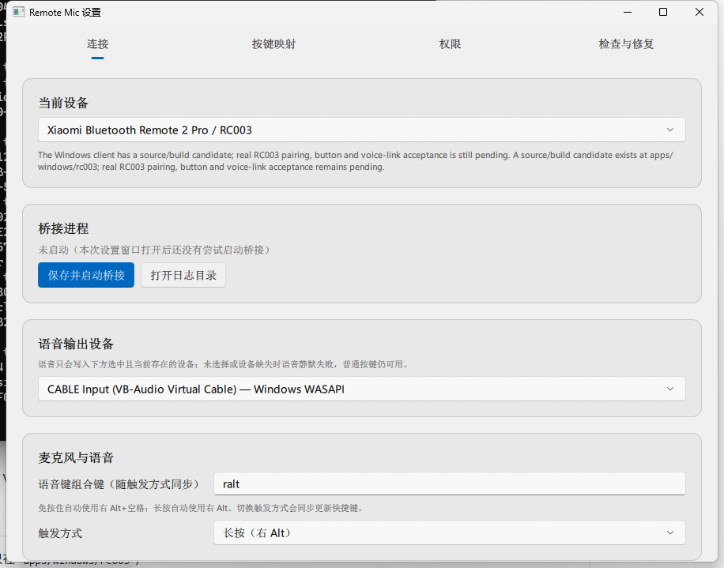

# Remote Vibe Coding

**Remote Vibe Coding（遥控语音编程）** 是面向 Windows 的遥控器交互工具。它把小米蓝牙遥控器 2 / 2 Pro（RC001 / RC003）的按键和语音转换成 Windows 能识别的输入，让用户离开键盘时也能快速唤起语音输入、操作 Codex，并完成常用的 vibe coding 流程。

本项目派生自 [`miaomiaozii/windows-remote-mic-app`](https://github.com/miaomiaozii/windows-remote-mic-app)，继续采用 GPL-3.0-only 开源。当前版本保留并扩展其 Windows 蓝牙、按键映射和 ATVV 语音桥接能力；macOS 应用、Swift 工程和 macOS 发布资源不属于本仓库。

Windows 客户端位于 [`apps/windows/rc003`](apps/windows/rc003/README.md)，提供：

- WinRT BLE 连接与 ATVV 语音解码；
- Windows Raw Input + Frida HID 旁路按键监听，SendInput 按键映射；
- 语音输出到用户明确选择的音频端点（配合虚拟声卡供输入法识别）；
- PySide6/Qt Quick 设置窗口、诊断和 PyInstaller/Inno Setup 构建。

当前版本是**已通过真实硬件验收的源码/构建候选**：已在真实 RC003 遥控器上完成
配对、逐键与语音链路验收（方向/OK/Home/Menu/TV/Power/返回/音量± 全部单次触发，
麦克风键可启动豆包输入法并识别语音）。产物未签名；CI 和自动构建不能替代真实
硬件验收。

## 项目方向

Remote Vibe Coding 将遥控器作为 Codex 的便携输入面板，优先建设以下能力：

- 按住语音键说话，松开后结束，把语音可靠地送入输入法或 Codex 输入框；
- 将方向、确认、返回和音量等实体键映射为 Codex 常用操作；
- 提供可见、可修改、可恢复默认值的按键方案；
- 只通过 Windows 公共 API、公开快捷键和用户可见界面协作，不读取第三方应用私有数据。

现有功能和真机验收结论仍以本文及 Windows 客户端文档明确列出的范围为准；路线中的新功能会在完成代码、Windows 构建和真实遥控器验证后标记为可用。

## RC001 兼容适配

小米蓝牙遥控器 2（RC001）现已加入同一 Windows 客户端。Windows 实机显示
RC001 与 RC003 使用相同的蓝牙 HID 身份（VID `0x2717` / PID `0x32B8`）、
相同的配对名称“小米蓝牙语音遥控器”和相同的 `AB5E0001…` ATVV 语音服务，
因此两款设备共用同一套按键、语音解码和音频输出后端。设置页中可单独选择
“小米蓝牙遥控器 2（RC001）”；原有 RC003 配置不迁移、不重命名。

当前适配已在一只 Model Number 明确上报为 `RC001` 的真机上验证：设备返回
ATVV v1.0、16 kHz、120-byte frame，语音键触发 `MIC_OPEN` 后成功收到并解码
PCM。该结论不依赖相同外观或 VID/PID 推断；更多固件版本和长时间稳定性仍建议
继续复核。

## 截图




> 截图在 Windows 11 + RC003 实测环境拍摄；如与你的系统主题/分辨率不同属正常差异。

## 下载与安装

当前可用的上游正式版：[v0.1.0-windows](https://github.com/miaomiaozii/windows-remote-mic-app/releases/tag/v0.1.0-windows)。Remote Vibe Coding 的独立发布版将在本仓库的 Releases 提供。

从 Release 页面 Assets 下载，二选一：

| 资产 | 适用场景 |
| --- | --- |
| `RemoteMicRC003Setup-0.1.0-candidate-unsigned.exe` | 推荐，安装到开始菜单/桌面并创建快捷方式 |
| `RemoteMicRC003-0.1.0-candidate-portable-unsigned.zip` | 免安装，解压到任意目录直接运行 |

两个都未签名，Windows SmartScreen 会提示，点“更多信息 → 仍要运行”即可。
建议同时下载 `SHA256SUMS.txt` 校验文件哈希。

## 快速开始（安装版）

1. 下载 `RemoteMicRC003Setup-...exe` 并运行，一路“下一步”完成安装；
2. 首次运行，或双击开始菜单的“Remote Vibe Coding 设置”，打开设置窗口（连接页）；
3. 在 Windows 设置 → 蓝牙中把 RC001 或 RC003 遥控器与电脑配对；
4. 回到设置窗口的“连接”页，选择实际型号，再点“保存并重启桥接”；首次使用时会直接启动，已有桥接时会先断开旧连接；
5. 按遥控器方向键/OK/返回/音量键验证；麦克风键会启动豆包输入法语音。

详细配对、虚拟声卡配置、按键映射和故障排查见
[`apps/windows/rc003/README.md`](apps/windows/rc003/README.md)。

## 从源码本地运行

在 Windows PowerShell 中执行：

```powershell
Set-Location apps/windows/rc003
python -m venv .venv
.\.venv\Scripts\python.exe -m pip install -r requirements-dev.txt
$env:PYTHONPATH = Join-Path (Get-Location) 'src'
.\.venv\Scripts\python.exe -m ovb_rc003 --settings
```

运行桥接（单独的桥接进程）：

```powershell
.\.venv\Scripts\python.exe -m ovb_rc003 --bridge
```

运行测试：

```powershell
.\.venv\Scripts\python.exe -m unittest discover -s tests -t . -p 'test_*.py' -v
```

构建未签名候选版：

```powershell
.\build\build-candidate.ps1
```

完整安装、配对、VB-CABLE 配置、已知限制和发布流程见 [`apps/windows/rc003/README.md`](apps/windows/rc003/README.md)。

## 仓库来源

- **直接上游**：[`miaomiaozii/windows-remote-mic-app`](https://github.com/miaomiaozii/windows-remote-mic-app)。Remote Vibe Coding 从该项目的 Windows 分支继续开发，并保留其提交历史、GPL 许可证和来源说明。
- **Fork 自**：[`HD838A/remote-mic-app`](https://github.com/HD838A/remote-mic-app)（无线麦 Remote Mic：把小米蓝牙遥控器 2 Pro / RC003 变成 Mac 语音输入设备）。本仓库只保留并继续维护其中的 Windows RC003 部分，macOS/Swift 部分不在此仓库维护。
- **Windows 上游参考实现**：[`nijez/open-voice-bridge`](https://github.com/nijez/open-voice-bridge)（GPL-3.0-only），提供 WinRT BLE、ATVV 语音协议、Raw Input、SendInput 和 Qt/QML 设置页的参考实现。
- **RC003 HID 旁路参考**：[`xxb26553663-star/remote-bridge-hub`](https://github.com/xxb26553663-star/remote-bridge-hub)（GPL-3.0-only），提供用 Frida Gadget 读取 Windows 普通输入链路拿不到的 RC003 返回/音量 HID 报告的实现思路。

Windows 实现的改动说明与第三方边界见
[`apps/windows/rc003/ATTRIBUTION.md`](apps/windows/rc003/ATTRIBUTION.md)、
[`COPYRIGHT.md`](COPYRIGHT.md) 和 [`THIRD_PARTY_NOTICES.md`](THIRD_PARTY_NOTICES.md)。

## 许可证

代码按 `GPL-3.0-only` 发布。完整许可证见 [`LICENSE.md`](LICENSE.md)。

## 维护边界

- 主程序源码只在 `apps/windows/rc003`；
- Windows CI 位于 `.github/workflows/windows-rc003-ci.yml`；
- `device-profiles` 只保留 Windows 客户端使用的设备目录；
- `LICENSE.md`、`COPYRIGHT.md`、`THIRD_PARTY_NOTICES.md` 和
  [`apps/windows/rc003/ATTRIBUTION.md`](apps/windows/rc003/ATTRIBUTION.md) 保留 GPL
  与上游来源义务，不代表继续维护原 macOS 应用。
